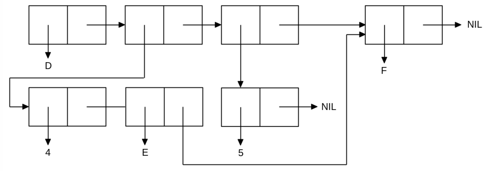

<p align="center"><b>МОНУ НТУУ КПІ ім. Ігоря Сікорського ФПМ СПіСКС</b></p>
<p align="center">
<b>Звіт з лабораторної роботи 1</b><br/>
"Обробка списків з використанням базових функцій"<br/>
дисципліни "Вступ до функціонального програмування"
</p>
<p align="right"><b>Студент</b>: Литвин Станіслав Романович КВ-23</p>
<p align="right"><b>Рік</b>: 2025</p>

## Загальне завдання
<!--
лістинг пунктів загального завдання можна навести або в одному блоці коду
із коментарями, що позначають початок виконання окремих пунктів, або ж
розділити весь лістинг на окремі блоки коду і додати для них підзаголовки
(напр. ### Пункт 1).
-->
```lisp
;; 1) Створення списку згідно умови завдання
CL-USER> (defvar mylist)
(setq mylist (cons 'A (cons 25 (cons '(X Y) (cons '() (list 'B))))))
(A 25 (X Y) NIL B)

;; 2) Отримання голови списку
CL-USER> (car mylist)
A

;; 3) Отримання хвосту списку
CL-USER> (cdr mylist)
(25 (X Y) NIL B)

;; 4) Отримання третього елементу списку
CL-USER> (nth 2 mylist)
(X Y)

;; 5) Отримання останнього елементу списку.
CL-USER> (car (last mylist))
B

;; 6.1) Використання предикати atom
CL-USER> (atom (car mylist))
T

CL-USER> (atom (nth 1 mylist))
T

CL-USER> (atom (nth 2 mylist))
NIL

;; 6.2) Використання предикати listp
CL-USER> (listp (car mylist))
NIL

CL-USER> (listp (nth 2 mylist))
T

CL-USER> (listp (nth 3 mylist))
T

;; 7) Використання інших предикат
CL-USER> (numberp (nth 1 mylist))
T

CL-USER> (equal (nth 2 mylist) '(X Y))
T

CL-USER> (null (nth 3 mylist))
T

;; 8) Об'єднання списків
CL-USER> (append mylist (nth 2 mylist))
(A 25 (X Y) NIL B X Y)
```
## Варіант 5
<p align="center">

</p>

```lisp
(let ((tail '(F)))
    (list* 'D (list* 4 'E tail) (list 5) tail))

;; Отриманий результат:
(D (4 E F) (5) F)
```